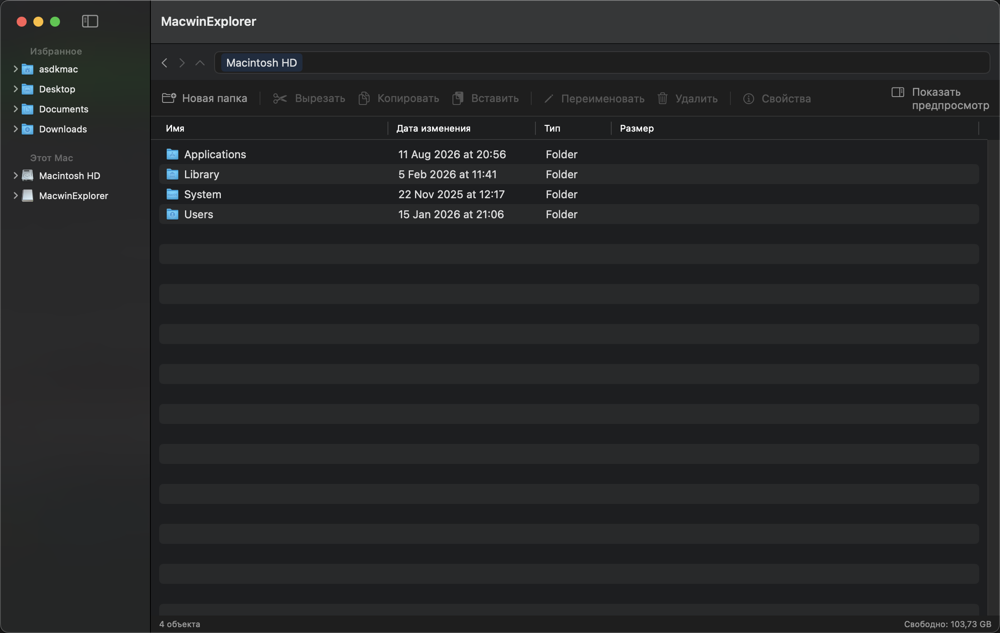
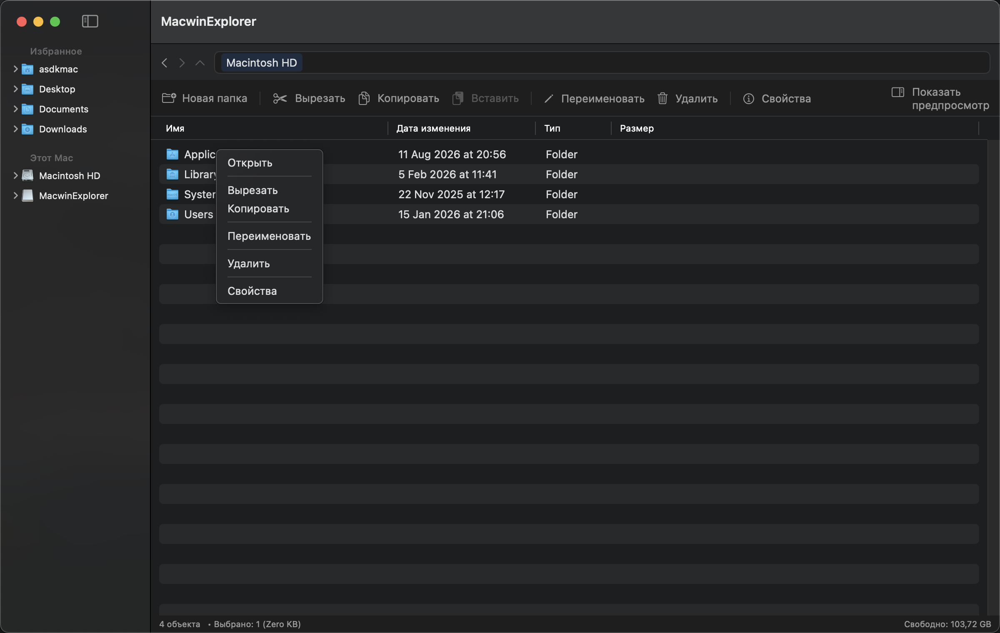
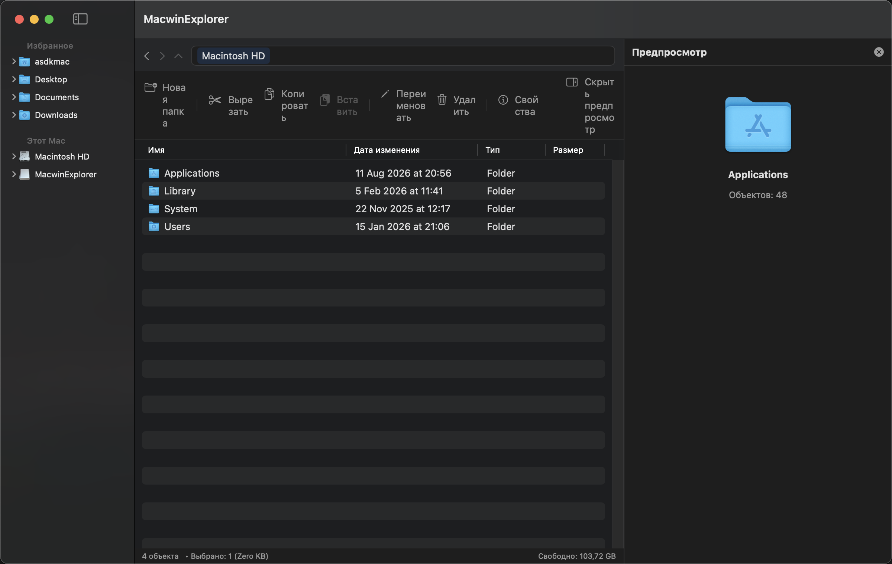
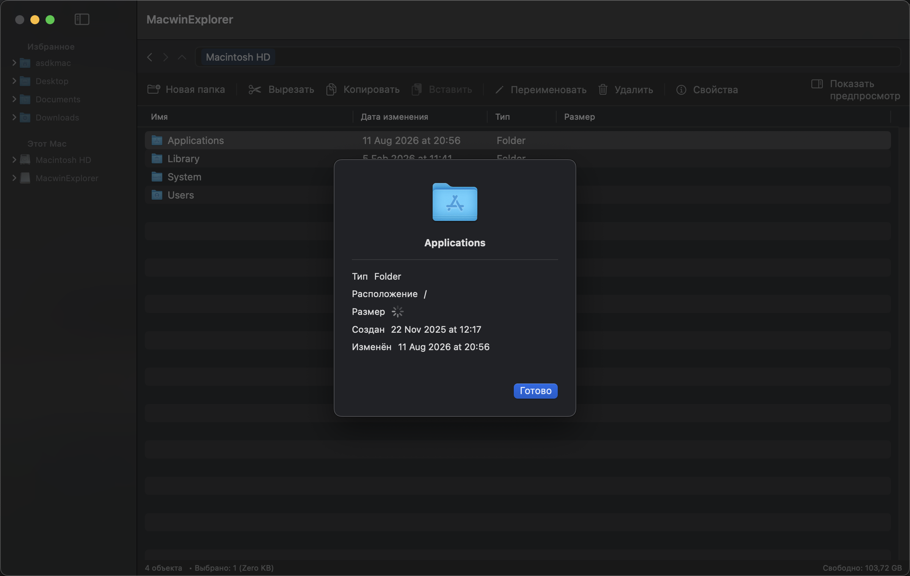
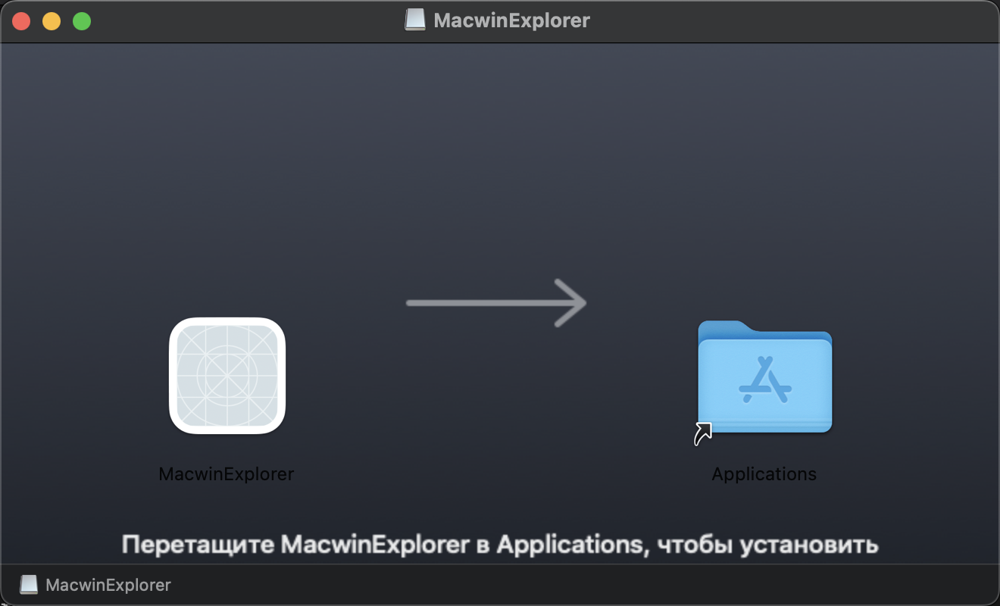

# MacwinExplorer

Файловый менеджер для macOS, который выглядит и ведёт себя как проводник Windows —
дерево дисков и папок слева, редактируемая адресная строка сверху, список файлов
с колонками и сортировкой, панель инструментов, контекстное меню и панель
предпросмотра справа. Написан на Swift (SwiftUI + AppKit), без App Sandbox.

<p align="center">
  
</p>

## Возможности

- **Навигация**: дерево дисков и избранного слева (лениво подгружает подпапки),
  редактируемая адресная строка-путь сверху, кнопки Назад / Вперёд / Вверх
- **Список файлов**: колонки Имя / Дата изменения / Тип / Размер с сортировкой по
  клику на заголовок
- **Файловые операции**: новая папка, переименование (инлайн), удаление в Корзину,
  вырезать / копировать / вставить — доступны через горячие клавиши, контекстное
  меню по правому клику и панель инструментов сверху
- **Свойства объекта** (⌘I): иконка, тип, расположение, размер (считается
  асинхронно, включая рекурсивный подсчёт для папок), даты создания/изменения
- **Панель предпросмотра справа** (⇧⌘P или кнопка в панели инструментов):
  - PDF, изображения, Word/Excel/PowerPoint, а также любой текстовый формат
    (`.txt`, `.md`, `.cs`, `.css`, `.html`, `.json`, `.swift`, …) — через
    системный Quick Look, как в Finder
  - Для диска (внутреннего или внешней флешки) — красивая круговая диаграмма
    занятого/свободного места
  - Для обычной папки — иконка и количество объектов
- **Настройки** (⌘,): показывать ли панель инструментов и в каком виде
  (иконки+текст / только иконки / только текст), показывать ли панель
  предпросмотра по умолчанию
- **Горячие клавиши**: ⌘C/⌘X/⌘V, Delete, Return (переименовать), ⌘↑ (вверх),
  ⌘[ / ⌘] (назад/вперёд), ⇧⌘N (новая папка), ⌘I (свойства), ⇧⌘P (предпросмотр)

<p align="center">
  
  
</p>
<p align="center">
  
  
</p>

## Сборка

Проект использует [XcodeGen](https://github.com/yonaskolb/XcodeGen) — `.xcodeproj`
не хранится в репозитории, а генерируется из `project.yml`.

```bash
brew install xcodegen
xcodegen generate
xcodebuild -project MacwinExplorer.xcodeproj -scheme MacwinExplorer \
  -configuration Debug -destination 'platform=macOS' build
```

Либо просто открыть папку в Xcode после `xcodegen generate`.

### DMG-установщик

```bash
./Scripts/build_dmg.sh
```

Соберёт Release-версию и упакует её в `build/MacwinExplorer-Installer.dmg` —
классическое окно «перетащите значок в Applications».

### Иконка приложения

Иконка генерируется программно (без внешних ассетов):

```bash
./Scripts/build_app_icon.sh
```

## Технические детали

- **Дистрибуция вне App Store, без sandbox** — полный доступ к файловой системе
  через Full Disk Access (System Settings → Privacy & Security), без ограничений
  NSOpenPanel. На первом запуске на другом Mac Gatekeeper покажет предупреждение
  «неизвестный разработчик» (сборка подписана только ad-hoc) — нужно открыть через
  правый клик → «Открыть».
- **Гибрид SwiftUI + AppKit**: каркас окна и панели — на SwiftUI, а дерево слева
  (`NSOutlineView`) и список файлов (`NSTableView`) — на AppKit, что даёт
  многоколоночную сортировку, drag-ready контекстное меню и инлайн-переименование,
  недоступные в чистом SwiftUI `List`/`Table`.
- **Предпросмотр** — тонкая обёртка над `QLPreviewView` (Quick Look), то есть
  использует те же генераторы превью, что и сам Finder.
- Минимальная версия macOS — 14.0 (Sonoma).

## Структура проекта

```
MacwinExplorer/
  App/            — точка входа
  Models/         — FileSystemItem, Volume
  Services/       — работа с файловой системой, буфер обмена, размер папок
  ViewModels/      — навигация, список файлов, дерево слева
  Views/          — SwiftUI + AppKit-компоненты интерфейса
  Utilities/      — форматтеры, ключи настроек
Scripts/          — генерация иконки и DMG-установщика
```
